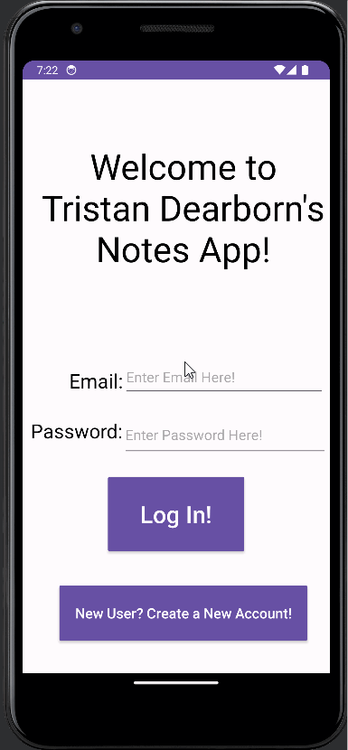

# Midterm Project

This is a notes app made in kolin.

## Functionality 

The following **required** functionality is completed:

* [ ] User can create a new account
* [ ] User can log in
* [ ] User can start a new note
* [ ] User can press save note button

The following **extensions** are implemented:

* If email is already is already in use on sign up, user is told
* If email or password is wrong on log in, user is told

## Video Walkthrough

Here's a walkthrough of implemented user stories:

GIF created with [LiceCap](http://www.cockos.com/licecap/).

## Notes

Did not get database to work to save notes into

## License

    Copyright [2023] [Tristan Dearborn]

    Licensed under the Apache License, Version 2.0 (the "License");
    you may not use this file except in compliance with the License.
    You may obtain a copy of the License at

        http://www.apache.org/licenses/LICENSE-2.0

    Unless required by applicable law or agreed to in writing, software
    distributed under the License is distributed on an "AS IS" BASIS,
    WITHOUT WARRANTIES OR CONDITIONS OF ANY KIND, either express or implied.
    See the License for the specific language governing permissions and
    limitations under the License.
